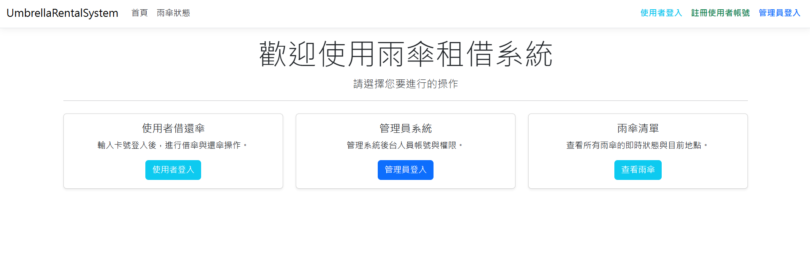
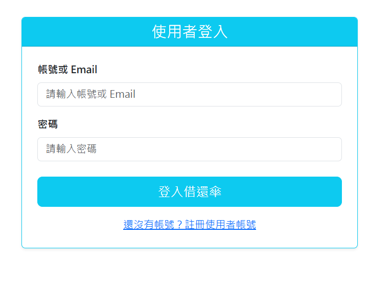
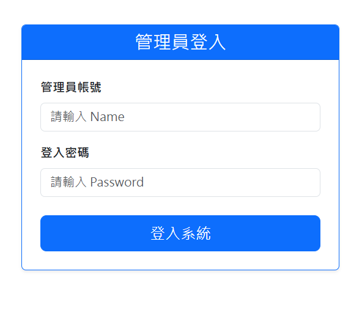
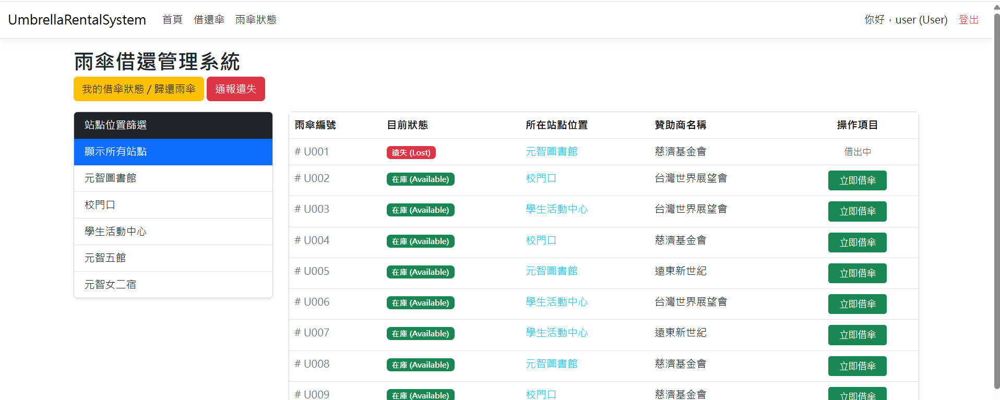
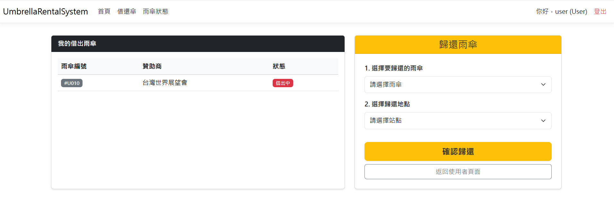
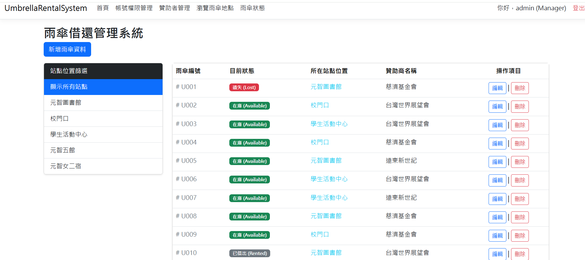
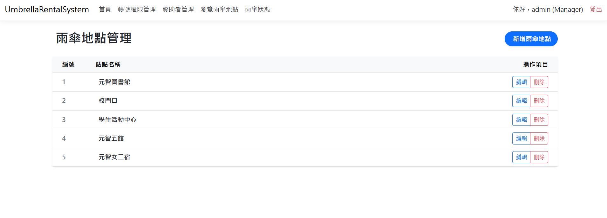
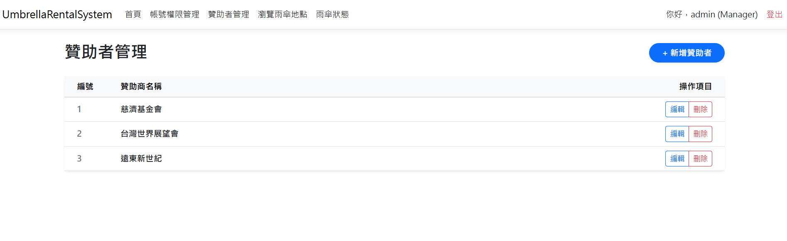
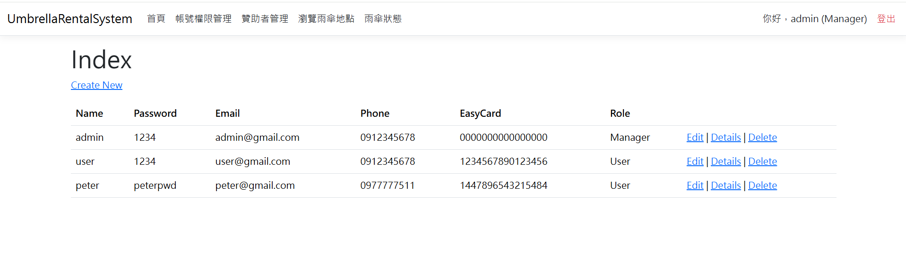

# ☂️ Umbrella Rental System

A web-based umbrella rental management system built with **ASP.NET Core MVC** and **Entity Framework Core**.

This project simulates a real-world umbrella sharing service, allowing users to borrow and return umbrellas at different locations while providing administrators with tools to manage umbrellas, stations, sponsors, and user accounts.

> ⚠️ This project was developed for learning and portfolio purposes. Some implementations (such as administrator account management and password storage) are simplified for demonstration.

---

# 📷 Demo

## Home

> 

---

## Login

> 
> 
---

## Borrow Umbrella

> 

---

## Return Umbrella

> 

---

## Umbrella Management

> 

---

## Location Management

> 

---

## Sponsor Management

> 

---

## Account Management

> 

---

# ✨ Features

## 👤 User

- Register and log in
- Log in using username or email
- Browse available umbrellas
- Borrow umbrellas
- Return umbrellas to any station
- Report lost umbrellas

---

## 👨‍💼 Administrator

- Administrator login/logout
- Manage umbrellas (Create / Read / Update / Delete)
- Filter umbrellas by location
- Manage rental locations
- Manage sponsors
- Manage user and administrator accounts *(for demonstration purposes)*

---

# 🛠 Tech Stack

| Category | Technology |
|----------|------------|
| Backend | ASP.NET Core MVC (.NET 10) |
| Language | C# |
| ORM | Entity Framework Core 10 |
| Database | SQL Server LocalDB |
| Frontend | Razor Views + Bootstrap |
| Authentication | Session |

---

# 🗄 Database Models

| Model | Description |
|------|-------------|
| Account | User and administrator information |
| Umbrella | Umbrella information and status |
| Location | Rental station |
| Sponsor | Sponsor information |
| Transaction | Borrow / Return records |
| LostReport | Lost umbrella reports |

---

# 🚀 Getting Started

## Requirements

- .NET 10 SDK
- SQL Server LocalDB

## Clone

```bash
git clone https://github.com/chirathexy-ops/RentUmbrella.git
```

## Restore

```bash
dotnet restore
```

## Run

```bash
dotnet run --project .\UmbrellaRentalSystem\UmbrellaRentalSystem.csproj
```

The application will automatically initialize the database according to the connection string in `appsettings.json`.

---

# 🔑 Demo Accounts

| Role | Username | Password |
|------|----------|----------|
| Administrator | admin | 1234 |
| User | user | 1234 |

> These accounts are for demonstration only.

---

# 📂 Project Structure

```text
UmbrellaRentalSystem
│
├── Controllers
├── Data
├── Models
├── Views
├── wwwroot
├── Migrations
├── Program.cs
└── appsettings.json
```

---

# 💡 Design Notes

- `UmbrellaId` is an auto-increment primary key used internally.
- `UmbrellaCode` is the identifier displayed to users.
- The system separates user and administrator functionalities through Session-based authentication.
- Administrator account creation is intentionally available to simplify testing and demonstration.

---

# 🚀 Future Improvements

- Docker support
- Cloud deployment (Render / Azure)
- Password hashing
- Email verification
- QR Code borrowing
- RESTful API
- Unit Testing

---

# 👨‍💻 Author

Developed by **Rain**

If you have any suggestions, feel free to open an Issue.
